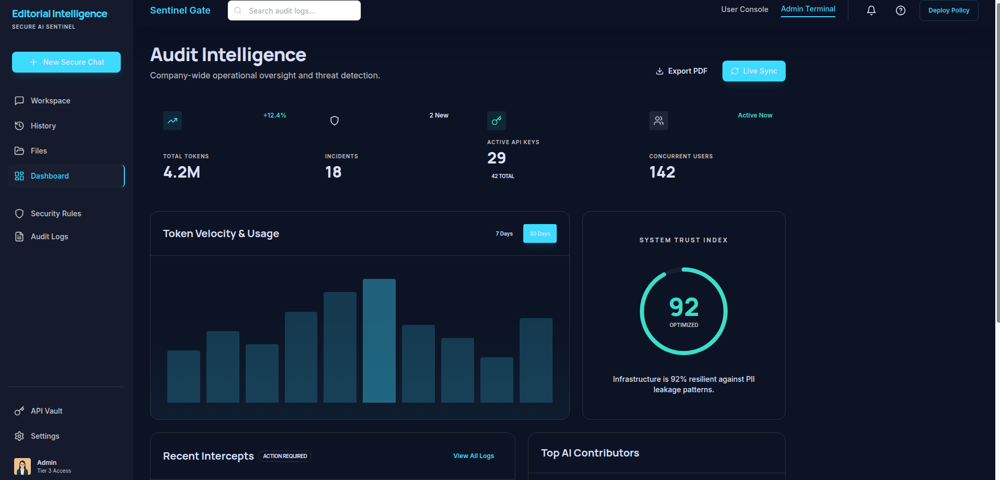
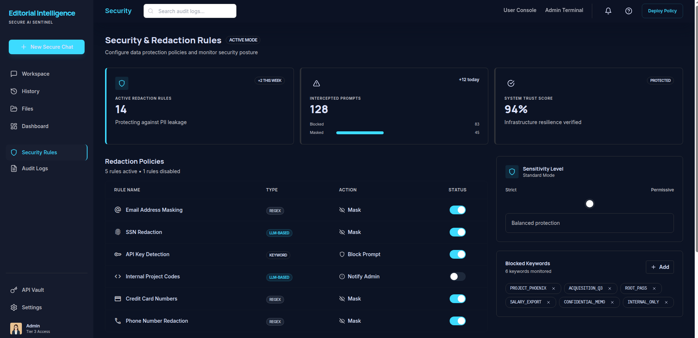

# Sentinel Gate

> **AI Security & File Management Dashboard UI**

A modern dashboard interface for AI security monitoring and file management. Built as a frontend-only prototype with mock data.

[](https://opensource.org/licenses/MIT)
[](https://reactjs.org/)
[](https://www.typescriptlang.org/)

🔗 **[Live Demo](https://sentinel-gate.vercel.app/)**

---

## 📸 Screenshots





---

## 🛠️ Tech Stack

| Category | Technology |
|----------|------------|
| **Framework** | React 18 |
| **Language** | TypeScript |
| **Routing** | React Router v6 |
| **State Management** | Zustand |
| **Styling** | Tailwind CSS |
| **UI Components** | Radix UI |
| **Animations** | Framer Motion |
| **Icons** | Lucide React |
| **Build Tool** | Vite |
| **Deployment** | Vercel |

> **Note:** This is a frontend-only prototype. All data is stored locally in mock data files - no backend or API connection required.

---

## ✨ Key Features

### 🎨 User Experience
- **Responsive Design** - Adapts to different screen sizes
- **Dark Theme** - Built-in dark mode with Tailwind CSS custom properties
- **Smooth Animations** - UI transitions powered by Framer Motion
- **Sidebar Navigation** - 8 pages with consistent layout

### 📄 Pages
- **Dashboard** - Overview with metrics and activity feed
- **Workspace** - Workspace management interface
- **Vault** - File vault UI component
- **Files** - File browser interface
- **Settings** - Settings page layout
- **Audit** - Audit logs display
- **Security** - Security rules interface
- **History** - History/chronological view

### ⚡ Technical
- **TypeScript** - Type-safe codebase
- **Mock Data** - All data is local (no API required)
- **Component Architecture** - Reusable UI components in `components/ui`
- **State Management** - Zustand for settings store

---

## 🚀 Getting Started

### Prerequisites

- **Node.js** v18+ or higher
- **npm** or **yarn** package manager

### Installation

```bash
# Clone the repository
git clone https://github.com/raihnraf/sentinel-gate.git

# Navigate to project directory
cd sentinel-gate

# Install dependencies
npm install

# Start development server
npm run dev
```

The application will be available at `http://localhost:5173`

### Build for Production

```bash
# Create production build
npm run build

# Preview production build locally
npm run preview
```

---

## 📁 Project Structure

```
src/
├── assets/          # Static assets (images, fonts, global styles)
├── components/      # Reusable UI components
│   ├── layout/      # Layout components (Sidebar, Header, etc.)
│   └── ui/          # Base UI components (Buttons, Cards, etc.)
├── data/            # Mock data and constants
├── features/        # Feature-specific components
├── hooks/           # Custom React hooks
├── lib/             # Utility libraries and configurations
├── pages/           # Route-based page components
│   ├── DashboardPage.tsx
│   ├── WorkspacePage.tsx
│   ├── VaultPage.tsx
│   ├── FilesPage.tsx
│   ├── SettingsPage.tsx
│   ├── AuditPage.tsx
│   ├── SecurityPage.tsx
│   └── HistoryPage.tsx
├── store/           # Zustand state management
├── utils/           # Helper functions and utilities
├── App.tsx          # Main application component
├── routes.tsx       # Route configuration
├── main.tsx         # Application entry point
└── index.css        # Global styles
```

---

## 📜 Available Scripts

| Command | Description |
|---------|-------------|
| `npm run dev` | Start development server with hot reload |
| `npm run build` | Build for production |
| `npm run preview` | Preview production build locally |
| `npm run lint` | Run ESLint for code quality checks |

---

## 🤝 Contributing

Contributions are welcome! Please feel free to submit a Pull Request.

1. Fork the repository
2. Create your feature branch (`git checkout -b feature/AmazingFeature`)
3. Commit your changes (`git commit -m 'Add some AmazingFeature'`)
4. Push to the branch (`git push origin feature/AmazingFeature`)
5. Open a Pull Request

---

## 📄 License

This project is licensed under the [MIT License](LICENSE).

---

## 👨‍💻 Author

**Raihan Rafi**

- 💼 LinkedIn: [linkedin.com/in/raihnraf](https://www.linkedin.com/in/raihnraf/)
- 🐙 GitHub: [@raihnraf](https://github.com/raihnraf)

---

## 🙏 Acknowledgments

- [Radix UI](https://www.radix-ui.com/) for accessible UI primitives
- [Tailwind CSS](https://tailwindcss.com/) for the utility-first CSS framework
- [Framer Motion](https://www.framer.com/motion/) for smooth animations
- [Lucide Icons](https://lucide.dev/) for beautiful icon set

---

<div align="center">

**Made with ❤️ using React + TypeScript**

[⬆ Back to Top](#sentinel-gate)

</div>
